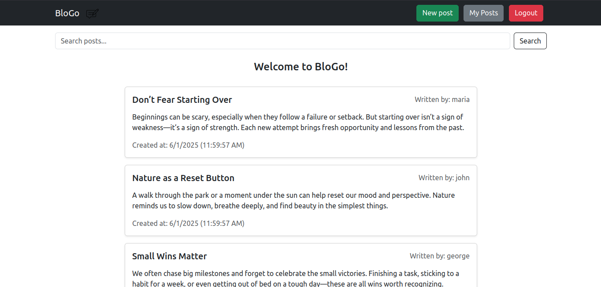
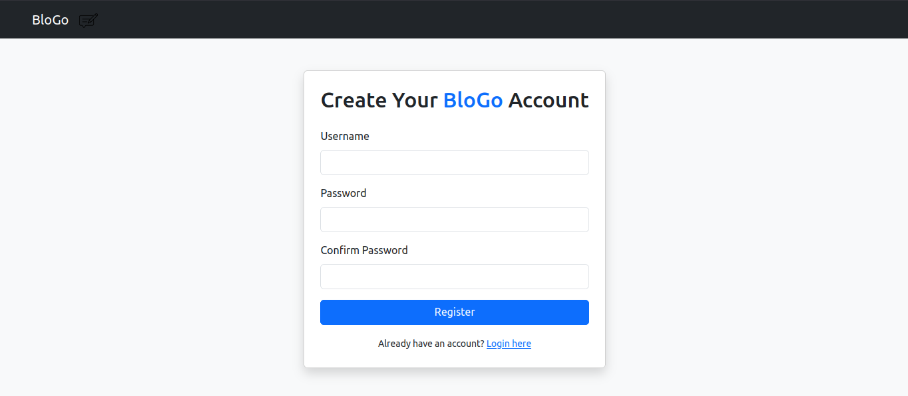
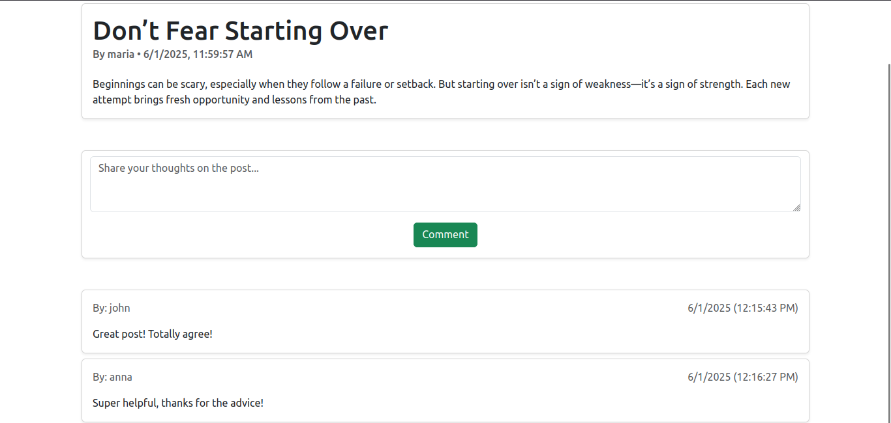
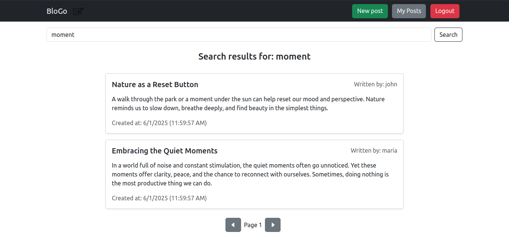

# BloGo :speech_balloon:
#### A full stack application using the Golang Gin framework in the backend, vanilla js with bootstrap in the frontend and sqlite for the database.



# Features

### Auth system
Implemented a secure login/register system using jwt authentication. Passwords are hashed and stored in the database using a seperate salt for each user.



### Posts
Users can create their own posts and other users can view them and comment their thougths



### Search bar and pagination
Implemented a simple search bar and added pagination to the whole app



## Setup and run :computer:
You need to clone the repo via git clone and then run two seperate servers, one for the backend and one for the frontend.
For the front, go into the frontend folder and spin up a simple python http server, e.g.
```
python -m http.server -b 127.0.0.1 5000
```
Before doing that, go in js/api.js file and specify the backend server's IP in API_BASE constant.

For the back, go into the backend folder and just run
```
go run main.go
```

This will go ahead and install all dependencies and spin up the backend server.
You should have a .env file in the backend folder like this one
```
JWT_SECRET="super_secret"
BACK_ADDR="127.0.0.1"
BACK_PORT="8081"
FRONT_ADDR="127.0.0.1"
FRONT_PORT="5000"
```